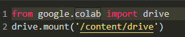
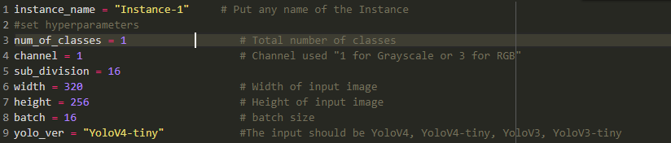

# TheEasyYolo

This repo contains a simple notebook **TheEasyYolo.ipynb** to train multiple instance of YoloV3 and YoloV4 with their tiny versions. You can train yolo with initilization of  different parameters like number of classes, channels, width and height. 

The directory structure:
    
    ├── TheEasyYolo
    ├────── Instance-1
    ├─────────── data
    ├─────────────── train
    ├─────────────── test
    ├────── Instance-2
    .
    .
    ├────── Instance-N
    ├────── darknet
    ├────── TheEasyYolo.ipynb
    ├────── README.md
    

# Instructions
## Setup on Google Drive
Link notebook with your google drive for saving checkpoint,

## Clone this repo
Clone this repository to your gdrive

## Setup the parameters and yolo settings
Setting up the yolo with different instance name as your project required, change the parameters according to custom training, 

## Upload the dataset to instance's name folder
After initilization the parameters of yolo, gather the dataset and label them according to yolo's label formating, and put the "data" folder in instance's name folder.
The data structure should like this:
  
    ├── data
    ├────── train
    ├──────── train
    ├────── test
    
    

## Generate train.names file and add all the classes name

